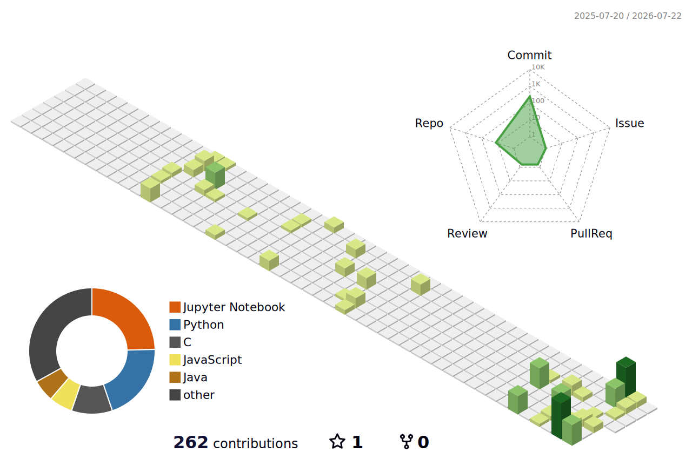

<!-- Top Divider -->

<h3 align="center"> BSc in CSE |  Turning data into stories</h3>

  

About Me

BSc in CSE @ East West University
Obsessed with clean data, dirty real-world problems
Interests: Machine Learning, Visualization
Research: knowledge distillation & self-supervised learning (SimCLR, BYOL, MAE) for rice classification
Building AgroMart — agricultural supply chain platform

 
 Tech Stack

 My Contribution Skyline

 Connect

### My Contribution Skyline
<picture>
  <source media="(prefers-color-scheme: dark)" srcset="profile-3d-contrib/profile-night-green.svg" />
  
</picture>

### Contribution Graph

### Contact

